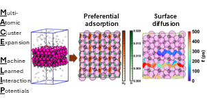

# Computational Scientist

Graduate Research Assisstant
Dave C. Swalm School of Chemical Engineering & Center for Advanced Vehicular Systems
Mississippi State University, Mississippi State, MS, 39762

### Education
- Ph.D. Chemical Engineering | Mississippi State University (_Expected August 2025_)
- M.S. Chemical Engineering | Mississippi State University (_May 2022_)
- B.S. Chemical Engineering with a Computer Science Minor | Mississippi State University (_May 2020_)

### Publications
- [Nature of molybdenum carbide surfaces for catalytic hydrogen dissociation using machine-learned potentials: an ensemble-averaged perspective](https://doi.org/10.1039/D4CY01202J)
  

### Molecular Simulation Skills

| Method              | Software | 
| :--------------------------------- | :------------: | 
| Ab initio Molecular Dynamics       |         CP2K   | 
| Quantum Chemistry                  |   Gaussian16   |
| Periodic Density Funcitonal Theory |  VASP          | 
| Classical Molecular Dynamics       |       LAMMPS   | 
| Classical Monte Carlo              |   Cassandra    | 
| Workflow Tools                     | ASE and MoSDeF |
| Machine Learned Interatomic Potentials | MACE, FLARE, NequIP, Allegro | 
| Reactive MD with Machine Learned Potentials | ASE and LAMMPS |
| Visualization  |   VMD and iRASPA |

### Programming Experience
- Fluent in Python
- Experience with C++ and Modern Fortran

### Contact
- [Personal Email](woodywilson001@yahoo.com) (Preferred)
- [School Email](wnw36@msstate.edu)
- [Linkedin](www.linkedin.com/in/woodrow-wilson-980490199)
- [Github](https://github.com/potus28)
- [Google Scholar](https://scholar.google.com/citations?user=MJDmPxcAAAAJ&hl=en)
